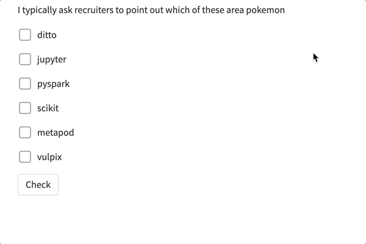

Multiple choice question
===========================

This functionality allows to ask a multiple choice question. 
It requires a question, the alternatives and the answer(s).
Optionally, the texts for success, error and button can be customized.

Python
--------

.. autofunction:: __init__.multiple_choice

An example code for a single choice questions is:

.. code-block:: python

    stb.true_or_false("Question description", 
                      {
                       "False alternative":False, 
                       "A true alternative":True, 
                       "Another false alternative":False, 
                       "Another true alternative":True, 
                       "Yet another false alternative":False
                       },
                      success="custom success message", 
                      error="custom error message", 
                      button="custom button text")

Markdown
----------

.. code-block:: none

    stb.multiple_choice
    Question
    [F] False alternative
    [T] A true alternative
    [F] Another false alternative
    [T] Another true alternative
    [F] Yet another false alternative
    success: custom success message
    error: custom error message
    button: custom button message

The success, error and button lines are optional, same as on the python implementation.

Example
----------

Python code:

.. code-block:: python
    
    stb.multiple_choice("I typically ask recruiters to point out which of these area pokemon",
                        {"ditto":True,
                         "jupyter":False,
                         "pyspark":False,
                         "scikit":False,
                         "metapod":True,
                         "vulpix":True},
                        success='Are you a pokemon master?', 
                        error="Gotta catch them all!", 
                        button='Check'
                       )

    
Markdown code:

.. code-block:: none

    stb.multiple_choice
    I typically ask recruiters to point out which of these area pokemon
    [T] ditto
    [F] jupyter
    [F] pyspark
    [F] scikit
    [T] metapod
    [T] vulpix
    success: Are you a pokemon master?
    error: Gotta catch them all!
    button: Check

Result:

