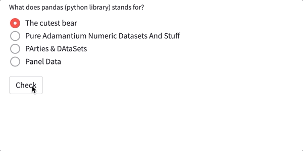

Single choice question
========================

This functionality allows to ask a single choice question. 
It requires a question, the alternatives and the (unique) answer.
Optionally, the texts for success, error and button can be customized.

Python
-------

.. autofunction:: __init__.single_choice

An example code for a single choice questions is:

.. code-block:: python

    stb.true_or_false("Question description", 
                      ["False alternative", "Another false alternative", 
                       "The true alternative", "Yet another false alternative"],
                      2, 
                      success="custom success message", 
                      error="custom error message", 
                      button="custom button text")

Notice that in this particular case, the true answer had index 2, but can be any other compatible index. 
As usual, success, error and button texts are optionals and can be customized.

Markdown
--------

Notice that the true alternative is preluded by character `+`,
while the false alternatives are preluded by character `-`. 
You can choose the order for all the alternatives.

.. code-block:: none

    stb.single_choice
    Question description
    - False alternative
    - Another false alternative
    + The true alternative
    - Yet another false alternative
    success: custom success message
    error: custom error message
    button: custom button message

The success, error and button lines are optional, same as on the python implementation.

Example
--------

Python code:

.. code-block:: python
    
    stb.single_choice("What does pandas (python library) stands for?",
                      ["The cutest bear", "Pure Adamantium Numeric Datasets And Stuff", 
                       "PArties & DAtaSets", "Panel Data"],
                      3,
                      success='Now you know!', 
                      error='Nopes, not this one...', 
                      button='Check'
                     )
    
Markdown code:

.. code-block:: none

    stb.single_choice
    What does pandas (python library) stands for?
    - The cutest bear
    - Pure Adamantium Numeric Datasets And Stuff
    - PArties & DAtaSets
    + Panel Data
    success: Now you know
    error: Nopes, not this one...
    button: Check

Result:

