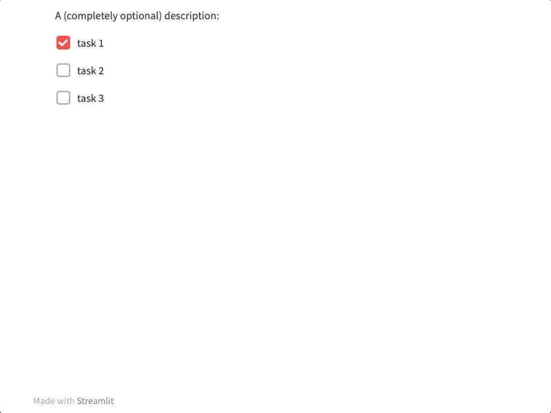

To do list
================

Markdown
--------

The to-do list follows the standard Markdown syntax.

.. code-block:: none

    stb.to_do_list
    A (completely optional) description for the to do list:
    - [x] task 1
    - [ ] task 1
    - [ ] task 3

Accepts the following optional parameter:

* `success:` This will get rendered on a st.success element when completing the tasks. If not provided, it just returns a default success message.

Python
--------

.. autofunction:: __init__.to_do_list

Example
--------

