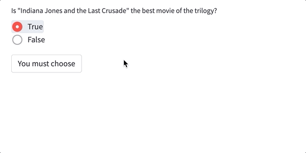

True or False question
--------------------------

This functionality allows to ask a true/false type of question. 
It requires a question and the solution as a True/False value. 
Optionally, the texts for success, error and button can be customized.

Python
~~~~~~~~~~~~~~~~~~~~

.. autofunction:: __init__.true_or_false

The code for questions with expected answer is True

.. code-block:: python

    stb.true_or_false("Question description", True, 
                      success="custom success message", 
                      error="custom error message", 
                      button="custom button text")

The code for a question with expected False answer is exactly similar.

Markdown
~~~~~~~~~~~~~~~~~~~~

Format for questions where expected answer is True

.. code-block:: none

    stb.true_or_false
    Question description
    True
    success: custom success message
    error: custom error message
    button: custom button message

Format for a question with expected False answer is exactly similar.

The success, error and button lines are optional, same as on the python implementation.

Example
~~~~~~~~~~~~~~~~~~~~

Python code:

.. code-block:: python
    
    stb.single_choice("What does pandas (python library) stands for?",
                      ["The cutest bear", "Pure Adamantium Numeric Datasets And Stuff", 
                       "PArties & DAtaSets", "Panel Data"],
                      3,
                      success='Now you know!', 
                      error='Nopes, not this one...', 
                      button='Check'
                     )

Markdown code:

.. code-block:: none

    stb.true_or_false
    Is "Indiana Jones and the Last Crusade" the best movie of the trilogy?
    True
    success: You have chosen wisely
    error: You have chosen poorly
    button: You must choose

Result:

